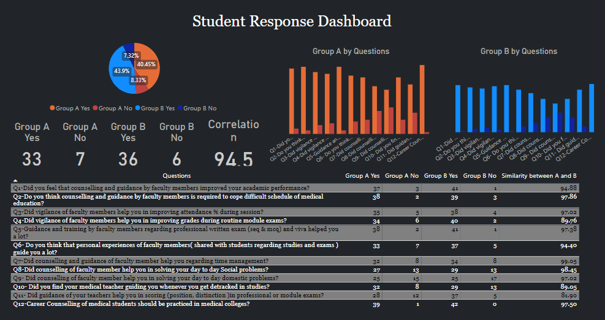
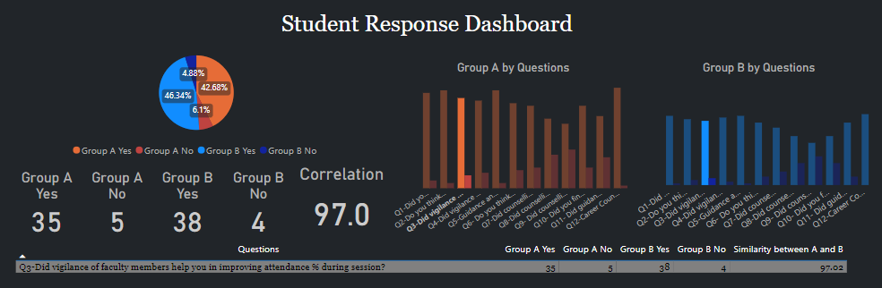
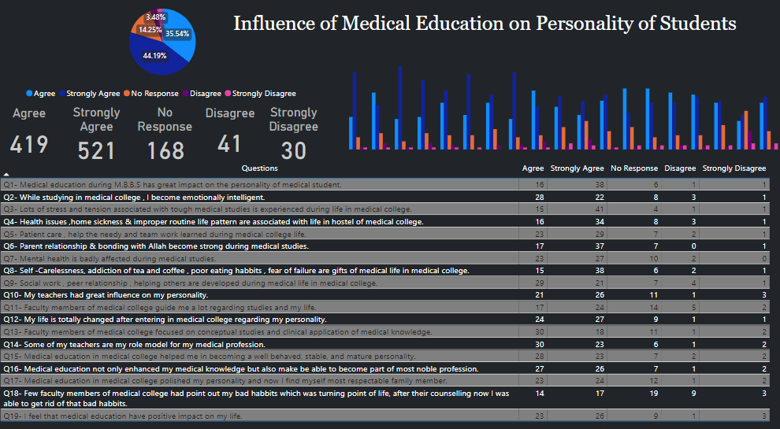
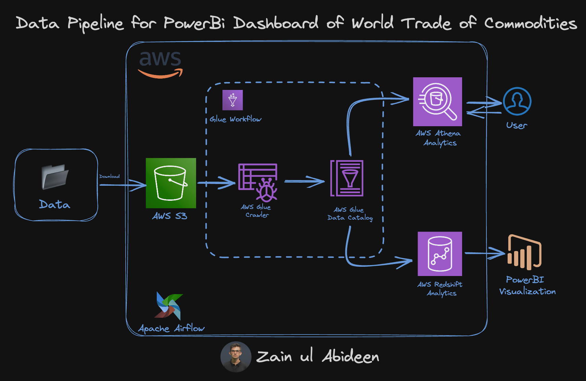
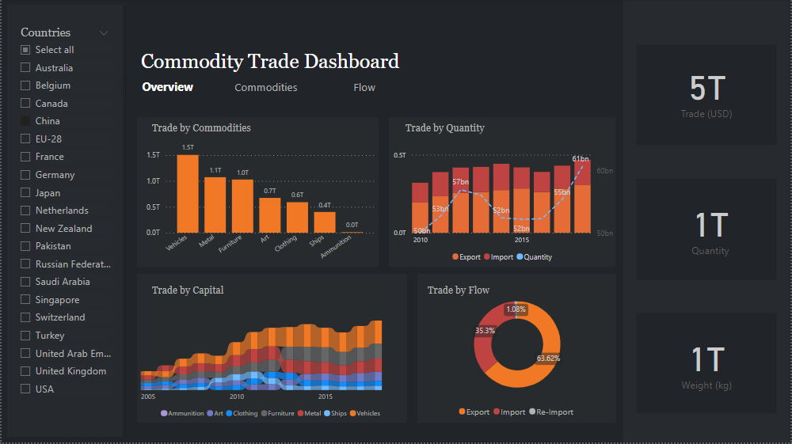
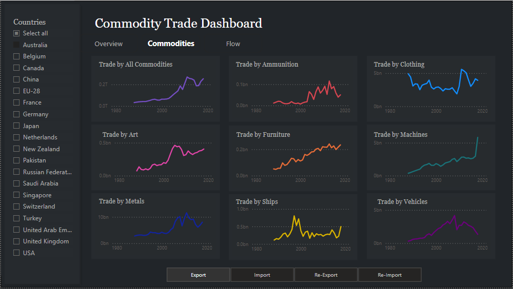
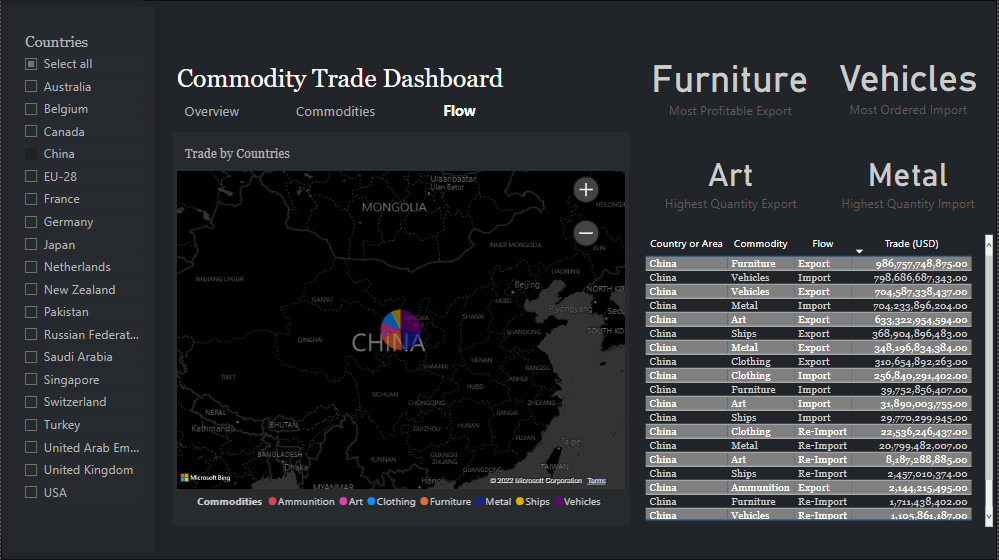

# Dashboards Of My Medical Research Paper :microscope: And World Trade :earth_asia: Of Commodities 


This repo contains the Dashboards of my Medical Research Paper (:link: [Fauzia et al.](https://pjmhsonline.com/index.php/pjmhs/article/view/4054/4006)) and World trade of Commodities. <br/>


## Table of Contents
  * [Influence of Medical Education on Personality of Students](#influence-of-medical-education-on-personality-of-students)
  * [World Trade of Commodities](#world-trade-of-commodities)
  * [Setup](#setup)
  * [Todos](#todos)
  * [Acknowledgements](#acknowledgements)
  * [Citation](#citation)
  * [Connect with me](#connect-with-me)


## Influence of Medical Education on Personality of Students

Medical education is renowned as one of the most challenging academic pursuits worldwide. It presents medical students with a myriad of academic and non-academic challenges that can significantly impact their scholastic achievements. This study aims to assess the influence of counseling and guidance, as perceived by medical students, on their academic performance. The research employed a cross-sectional design, focusing on 3rd-year MBBS students at Azra Naheed Medical College, Lahore, who were categorized into two groups (A and B) based on their academic performance in the 2021-2022 professional and module examinations. The study utilized a Google form designed by the authors, consisting of 13 questions that gauged students' perceptions regarding the impact of counseling and guidance on various factors affecting their academic progress. The questionnaire was distributed through two official WhatsApp groups (A and B), with group A comprising high-performing students and group B including those with average and below-average academic achievements.

<p align="center">

</p>

<p align="center">

</p>

The findings revealed that 40 students from group A and 42 students from group B responded to the questionnaire. A notable percentage of students from both groups expressed positive opinions concerning the supportive role of faculty counseling and guidance in managing the rigorous demands of medical studies, exam preparation, time management, as well as addressing social, domestic, attendance-related issues, and overall academic performance. Question 12, which pertained to career counseling for medical students in medical colleges, received positive responses from 97.5% of students in both groups, indicating a significant correlation. The results underscore the importance of faculty support for students with varying academic performances, emphasizing the pivotal role of faculty members in addressing academic and non-academic challenges. This study underscores the significance of student counseling in medical education and advocates for the establishment of dedicated counseling departments in medical institutions to enhance students' academic and non-academic well-being.


<p align="center">

</p>


In conclusion, this research underscores the crucial role played by faculty members in addressing the academic and non-academic challenges faced by medical students. The findings of this recent study underscore students' recognition of faculty members' supportive role in enhancing their academic performance through guidance and counseling.

## World Trade of Commodities

In this project, I aggregated data pertaining to the global trade of commodities, which was sourced from the United Nations. Subsequently, I carried out data preprocessing tasks, such as consolidating related Excel files, such as silk, wool, and cotton, into a unified category, specifically 'clothing.' I adopted a similar approach to amalgamate commodities with shared characteristics into coherent segments. Following these data preparation steps, I imported the refined dataset into Power BI, culminating in the creation of the subsequent report.

<p align="center">

</p>

When it comes to storing the Commodities trade data, I leveraged AWS S3, which serves as the data repository. I employed AWS Glue Data Crawler to automatically discover and catalog the metadata of our dataset, making it accessible through the AWS Glue Data Catalog. For user interactions with the data, I harnessed AWS Athena, allowing users to run SQL-like queries on the data stored in S3. Additionally, I utilized AWS Redshift, which is a powerful data warehousing solution, to aggregate, process, and store large volumes of data for reporting purposes. To visualize and analyze this data effectively, I constructed Power BI dashboards.

<p align="center">

</p>

The entire process is thoughtfully orchestrated and automated using Apache Airflow, a robust workflow automation platform. It streamlines the flow of data from its source in the United Nations dataset to AWS S3, through data preprocessing, cataloging, and storage in Redshift, and finally, to the creation of insightful reports in Power BI. This orchestration ensures that the data pipeline is well-organized and efficient, making the entire process highly manageable and scalable.


<p align="center">

</p>

The dashboard provides a comprehensive view of countries' trade activities, encompassing imports, exports, re-imports, and re-exports. It covers the trade of various categories, including metals, ammunition, clothing, art, furniture, machinery, vehicles, and ships, spanning the period from 1980 to 2020. Additionally, the dashboard highlights key trade insights such as the most lucrative export, the most frequently ordered import, the highest-quality export, and the highest-quality import.

Users have the flexibility to choose between viewing data for all countries collectively or selecting specific countries to access tailored information. The dashboard presents a range of data metrics, including trade values in USD, quantities, product weights, and trade flow details, ensuring a comprehensive and detailed understanding of international trade dynamics.

<p align="center">

</p>

## Setup


Let's get this thing running! Follow the next steps:

1. `git clone https://github.com/abideenml/Dashboards-ofmy-MedicalResearchPaper-and-WorldTrade`
2. Navigate into project directory `cd path_to_repo`
3. Open the PowerBI dashboards file: `Powerbi Report of Commodities data.pbix`, `Influence of Medical  Education on Personality.pbix` and `Student Response Dashboard.pbix`.

That's it! <br/>


## Todos:

Finally there are a couple more todos which I'll hopefully add really soon:
* Automate the entire process of Data preprocessing and scraping from International Monetary Fund website.
* Perform Data collection from different Pakistani Medical Colleges.


## Acknowledgements

I found these resources useful (while developing this one):

* [Internationl Monetary Fund Commodity Trade](https://data.imf.org/?sk=2cddccb8-0b59-43e9-b6a0-59210d5605d2)
* [Pakistan Journal of Medical Sciences](https://www.pjms.org.pk/index.php/pjms)
* [AWS Big Data Blogs](https://aws.amazon.com/blogs/big-data/category/analytics/aws-glue/)


## Citation

If you find this code useful, please cite the following:

```
@misc{Zain2023,
  author = {Zain, Abideen},
  title = {dashboard-medical-paper-worldtrade},
  year = {2023},
  publisher = {GitHub},
  journal = {GitHub repository},
  howpublished = {\url{https://github.com/abideenml/Dashboards-ofmy-MedicalResearchPaper-and-WorldTrade}},
}
```

## Connect with me

If you'd love to have some more AI-related content in your life :nerd_face:, consider:

* Connect and reach me on [LinkedIn](https://www.linkedin.com/in/zaiinulabideen/) and [Twitter](https://twitter.com/zaynismm)
* Follow me on 📚 [Medium](https://medium.com/@zaiinn440)
* Subscribe to my 📢 weekly [AI newsletter](https://rethinkai.substack.com/)!

## Licence

[](https://github.com/abideenml/Dashboards-ofmy-MedicalResearchPaper-and-WorldTrade/blob/master/LICENCE)

