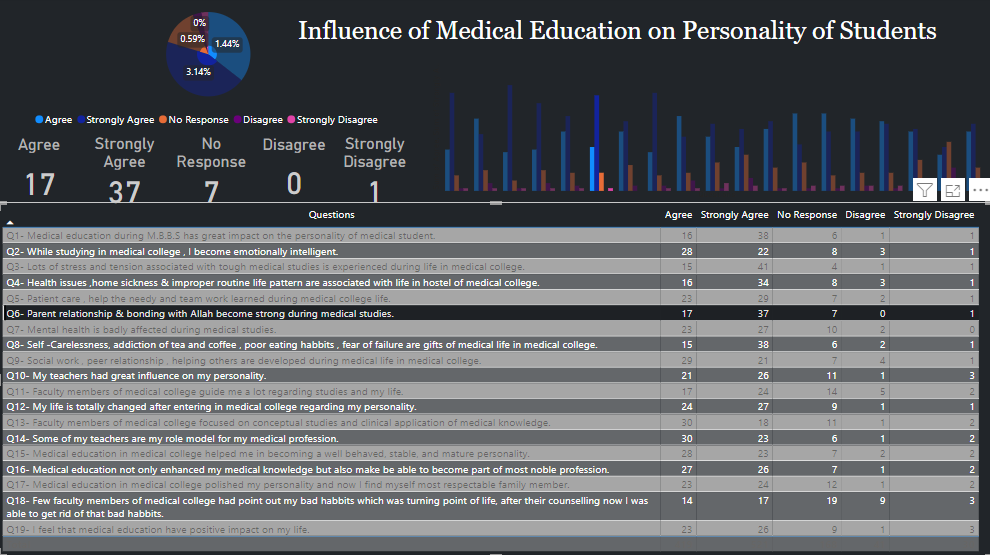

# Dashboards Of My Medical Research Paper :microscope: And World Trade :earth_asia: Of Commodities 

In this project, I have aggregated Data of World Trade of Commodities from United Nations. Then i have performed data preprocessing on it to combine similar excel files like silk, wool and cotton into clothing. In the same way I have combined commodities of similar niche into one segment. Then i have imported the data in Power BI and 
made the following report:

This repo contains the Dashboards of my Medical Research Paper (:link: [Fauzia et al.](https://pjmhsonline.com/index.php/pjmhs/article/view/4054/4006)) and World trade of Commodities. <br/>


## Table of Contents
  * [Influence of Medical Education on Personality of Students](#influence-of-medical-education-on-personality-of-students)
  * [World Trade of Commodities](#world-trade-of-commodities)
  * [Setup](#setup)
  * [Todos](#todos)
  * [Acknowledgements](#acknowledgements)
  * [Citation](#citation)
  * [Connect with me](#connect-with-me)


## Influence of Medical Education on Personality of Students

<p align="center">

</p>

<p align="center">

</p>

<p align="center">

</p>

<p align="center">

</p>

## World Trade of Commodities

<p align="center">

</p>

<p align="center">

</p>

<p align="center">

</p>

<p align="center">

</p>

## Setup


Let's get this thing running! Follow the next steps:

1. `git clone https://github.com/abideenml/Dashboards-ofmy-MedicalResearchPaper-and-WorldTrade`
2. Navigate into project directory `cd path_to_repo`
3. Open the PowerBI dashboards file: `Powerbi Report of Commodities data.pbix`, `Influence of Medical  Education on Personality.pbix` and `Student Response Dashboard.pbix`.

That's it! <br/>


## Todos:

Finally there are a couple more todos which I'll hopefully add really soon:
* Automate the entire process of Data preprocessing and scraping from International Monetary Fund website.
* Perform Data collection from different Pakistani Medical Colleges.


## Acknowledgements

I found these resources useful (while developing this one):

* [Internationl Monetary Fund Commodity Trade](https://data.imf.org/?sk=2cddccb8-0b59-43e9-b6a0-59210d5605d2)
* [Pakistan Journal of Medical Sciences](https://www.pjms.org.pk/index.php/pjms)
* [AWS Big Data Blogs](https://aws.amazon.com/blogs/big-data/category/analytics/aws-glue/)


## Citation

If you find this code useful, please cite the following:

```
@misc{Zain2023,
  author = {Zain, Abideen},
  title = {dashboard-medical-paper-worldtrade},
  year = {2023},
  publisher = {GitHub},
  journal = {GitHub repository},
  howpublished = {\url{https://github.com/abideenml/Dashboards-ofmy-MedicalResearchPaper-and-WorldTrade}},
}
```

## Connect with me

If you'd love to have some more AI-related content in your life :nerd_face:, consider:

* Connect and reach me on [LinkedIn](https://www.linkedin.com/in/zaiinulabideen/) and [Twitter](https://twitter.com/zaynismm)
* Follow me on 📚 [Medium](https://medium.com/@zaiinn440)
* Subscribe to my 📢 weekly [AI newsletter](https://rethinkai.substack.com/)!

## Licence

[](https://github.com/abideenml/Dashboards-ofmy-MedicalResearchPaper-and-WorldTrade/blob/master/LICENCE)

